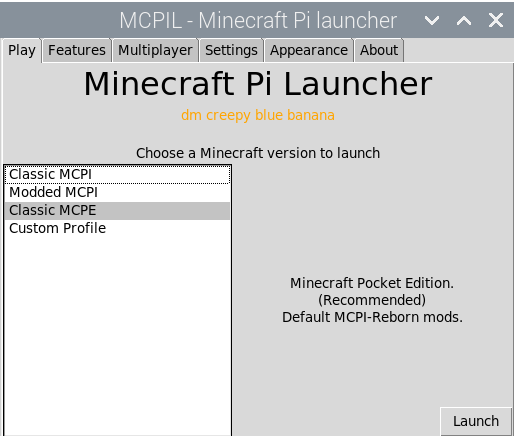

# MCPIL

MCPIL collectively refers to a group of launchers for Minecraft: Pi
Edition, developed and maintained by the MCPI Revival project.

## Old Launcher (MCPIL-Legacy)

The original Launcher started as the main project of MCPI-Revival
(previously known as MCPI-Devs), featuring various projects such as
ModPi and the multiplayer proxy, but when
[MCPI-Reborn](../Reborn/Introduction.md) (previously MCPI-Docker) was
created, the project tried to be compatible with it, resulting in a
fragile *"only works on my machine"* program. After an hiatus, the
project was abandoned. It was officially deprecated after after the
MCPIL-R release.

<table>
<thead>
<tr class="header">
<th>
Version
</th>
<th>
Sub-version (pre-releases, snapshots, etc.)
</th>
<th>
Changes
</th>
</tr>
</thead>
<tbody>
<tr class="odd">
<td>
v0.7.3
</td>
<td>
Full Release
</td>
<td>
Fixed Python 3.8+ compatibility.
</td>
</tr>
<tr class="even">
<td>
v0.7.2
</td>
<td>
Full Release
</td>
<td>
Fixed GLFW-related bug.
</td>
</tr>
<tr class="odd">
<td>
v0.7.1
</td>
<td>
Full Release
</td>
<td>
Attempt to fix MCPI-Reborn integration.
</td>
</tr>
<tr class="even">
<td>
v0.7.0
</td>
<td>
Never released
</td>
<td rowspan="2">
Initial integration with MCPI-Reborn mods.
</td>
</tr>
<tr class="odd">
<td>
v0.7.0-rc1
</td>
<td>
Release Candidate
</td>
</tr>
<tr class="even">
<td>
v0.6.2
</td>
<td>
Full Release
</td>
<td>
Fixed bugs.
</td>
</tr>
<tr class="odd">
<td>
v0.6.1
</td>
<td>
Full Release
</td>
<td>
Corrected typos.
</td>
</tr>
<tr class="even">
<td>
v0.6.0
</td>
<td>
Full Release
</td>
<td rowspan="3"><ul>
<li>Better threading.</li>
<li>Various fixes.</li>
</ul></td>
</tr>
<tr class="odd">
<td>
v0.6.0-rc2
</td>
<td>
Release Candidate
</td>
</tr>
<tr class="even">
<td>
v0.6.0-rc1
</td>
<td>
Release Candidate
</td>
</tr>
<tr class="odd">
<td>
v0.5.0
</td>
<td>
Full Release
</td>
<td>
First version with Debian packaging.
</td>
</tr>
<tr class="even">
<td>
v0.4.0
</td>
<td>
Full Release
</td>
<td><ul>
<li>Added ModPi integration.</li>
<li>Fixed bugs.</li>
</ul></td>
</tr>
<tr class="odd">
<td>
v0.3.0
</td>
<td>
Full Release
</td>
<td><ul>
<li>Better stability.</li>
<li>Rootless installation and usage.</li>
<li>Fixed bugs.</li>
</ul></td>
</tr>
<tr class="even">
<td>
v0.2.0
</td>
<td>
Full Release
</td>
<td><ul>
<li>Added Mod API.</li>
<li>Added Mod compilation.</li>
<li>Proxy integration.</li>
<li>Fixed bugs.</li>
</ul></td>
</tr>
<tr class="odd">
<td>
v0.1.1
</td>
<td>
Full Release
</td>
<td><ul>
<li>Added world settings.</li>
</ul></td>
</tr>
<tr class="even">
<td>
v0.1.0
</td>
<td>
Full Release
</td>
<td>
Initial release.
</td>
</tr>
</tbody>
</table>
<section id="footnotes" class="footnotes footnotes-end-of-document"
role="doc-endnotes">

<ol>
<li id="fn1"><a
href="https://github.com/MCPI-Revival/MCPIL-Legacy/releases">MCPIL-Legacy
Releases</a><a href="#fnref1" class="footnote-back"
role="doc-backlink">↩︎</a></li>
</ol>
</section>

Timeline for MCPIL-Legacy: <https://github.com/MCPI-Revival/MCPIL-Legacy/releases>

### Developers

[Alvarito050506](UserWiki:Alvarito050506 "wikilink"),
[gamer4life1](https://github.com/lpuv),
[StealthHydra179](UserWiki:StealthHydrac "wikilink"),
[nobody5050](https://github.com/nobody5050) and
[Khhs167](https://github.com/Khhs167).

## Reborn Project (MCPIL-R)

After the abandonment of the original project, a new one was built, with
some concepts like MCPI-Reborn integration and a better internal design
in mind. This version was deprecated, and had reached most of its goals.

<table>
<thead>
<tr class="header">
<th>
Version
</th>
<th>
Sub-version (pre-releases, snapshots, etc.)
</th>
<th>
Changes
</th>
</tr>
</thead>
<tbody>
<tr class="odd">
<td>
0.2.0
</td>
<td>
Unreleased beta
</td>
<td>
Taskbar Icons, Splash text,

Dark theme,

Appearance tab,

Optmised MCPE profile

Option to hide launcher on boot
</td>
</tr>
<tr class="even">
<td>
0.1.9
</td>
<td>
Full Release
</td>
<td>
Better proxy threading
</td>
</tr>
<tr class="odd">
<td>
0.1.8
</td>
<td>
Full Release
</td>
<td>
Added render distance options.
</td>
</tr>
<tr class="even">
<td>
0.1.7
</td>
<td>
Full Release
</td>
<td>
Added the <code>thebrokenrail.com</code> server typed in by
default.
</td>
</tr>
<tr class="odd">
<td>
0.1.6
</td>
<td>
Full Release
</td>
<td>
Fixed typo.
</td>
</tr>
<tr class="even">
<td>
0.1.5
</td>
<td>
Full Release
</td>
<td>
Dropped the <em><code>-R</code></em> (<em>Reboot</em>) from the
name.
</td>
</tr>
<tr class="odd">
<td>
0.1.4
</td>
<td>
Full Release
</td>
<td>
Update to reflect MCPI-Reborn name change
</td>
</tr>
<tr class="even">
<td>
0.1.3
</td>
<td>
Full Release
</td>
<td>
Changed logo from Nether Reactor to Raspberry Pie.
</td>
</tr>
<tr class="odd">
<td>
0.1.2
</td>
<td>
Full Release
</td>
<td>
Fixed multiplayer proxy not starting/stopping correctly.
</td>
</tr>
<tr class="even">
<td>
0.1.1
</td>
<td>
Full Release
</td>
<td>
Updated multiplayer proxy version.
</td>
</tr>
<tr class="odd">
<td>
0.1.0
</td>
<td>
Full Release
</td>
<td>
Initial Release.
</td>
</tr>
</tbody>
</table>

Timeline for MCPIL: <https://github.com/MCPI-Revival/MCPIL/releases>

### Developers

[TheBrokenRail](https://github.com/TheBrokenRail),
[Alvarito05050](UserWiki:Alvarito050506 "wikilink"),
[StealthHydra179](UserWiki:StealthHydrac "wikilink"),
[nobody5050](https://github.com/nobody5050),
[RPiNews](https://www.youtube.com/channel/UCmp6JswV90SV5agNFGQuWkw),
[gamer4life1](https://github.com/lpuv) and
[LEHAtupointow](https://github.com/leha-code/).

## jMCPIL and gMCPIL

After the deprecation of MCPIL-R, two new competing launchers were
developed, jMCPIL and [gMCPIL](GMCPIL.md).
The former is written in Java using the built-in Swing library, and the
later is written in C using the GTK+ 3 library (later rewritten to use
Vala for the frontend). These two competed to replace MCPIL-R, and due
to rigged submissions during the vote, both replaced MCPIL-R, with users
being able to choose between the two in the Pi-Apps installer.

### Developers

[TheBrokenRail](https://github.com/TheBrokenRail) (jMCPIL),
[Alvarito05050](UserWiki:Alvarito050506 "wikilink") (gMCPIL).

## Trivia

* There is no "World Settings" tab in any MCPIL launcher except MCPIL-Legacy.