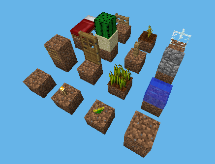

# Render Shape List



Most tiles render as a cube,
but this is only one of 15 shapes that can be rendered by default, here
is the complete list of every shape along with it's ID (which is
returned from the tiles `getRenderShape` method):

```text
- 0: Block, a cube, for example: dirt
- Only shape that respects custom size

- 1: Cross, a flat texture crossed, for example: saplings
- Data depends
- Pos-based random offset hardcoded

- 2: Torch, a possibly angled rectangle
- Ignores custom color
- Calls getTexture incorrectly

- 3: Fire
- Not rendered
- Returned by FireTile::getRenderShape for future use

- 4: Water, any liquid
- Neighbor dependent
- Data dependent
- Ignores custom color

- 6: Row, like cross but doubled, for example: crops

- 7: Door, a smooshed rectangle
- DoorTile's vtable required
- Ignores custom color

- 8: Ladder, a flat texture along a wall
- Ignores custom color
- Data depend

- 10: Stairs, layered rectangles
- Data dependent
- StairTile's vtable required

- 11: Fence, a pole with two possible arms per side
- Overwrites shape
- FenceTile's vtable is required

- 13: Cactus, a cube with smaller sides and a possibly smaller top

- 14: Bed, a very short cube
- Data dependent
- Ignores custom color

- 18: Thin fence, a thin version of fence, for example: glass panes
- Neighbor dependent

- 19: Stem, like cross but diagonal
- Requires tile to implement StemTile's vtable

- 21: Fence gate, a thin floating rectangle
- Data dependent
- FenceGateTile's vtable required
- Overwrites shape
```

By default, anything not on this list won't get rendered, using -1 to
denote that it shouldn't be rendered is standard. The shape of a tile
isn't necessarily the size and positions.

## Custom Shapes

There are a few types of custom shapes, ones made of a single rectangle,
ones made of many rectangles, and ones made of many polygons (which may
or may not be rectangles).

### Single Rectangle

A single rectangle is the easiest, all that is needed is to call
`Tile::setShape` on the tile, this is how slabs work.

### Multiple Rectangles

To make a shape out of multiple rectangles, the
`TileRenderer::tesselateInWorld` function must be changed. This function
has many helper functions for different shapes, which can be seen in
`libreborn.so`, however in `minecraft-pi` many of these helper functions
are inlined, or partially inlined. Then `Tile::setShape` can be called
in-between `TileRenderer::tesselateBlockInWorld` calls, this is how
stairs and fences work.

### Polygons

This is the hardest method to make custom shapes, it also requires
changing `TileRenderer::tesselateInWorld`. using `Tesselator` draw the
vertexes for the shape, every four vertexes will become a polygon so be
sure that the number of calls is divisible by four or it will leak into
other shapes and ruin them. A simple square can be drawn like this:

```cpp
Tesselator::vertex(Tesselator::instance, x,     y, z);
Tesselator::vertex(Tesselator::instance, x + 1, y, z);
Tesselator::vertex(Tesselator::instance, x + 1, y, z + 1);
Tesselator::vertex(Tesselator::instance, x,     y, z + 1);
```

Do note that this will only be visible from under the block.