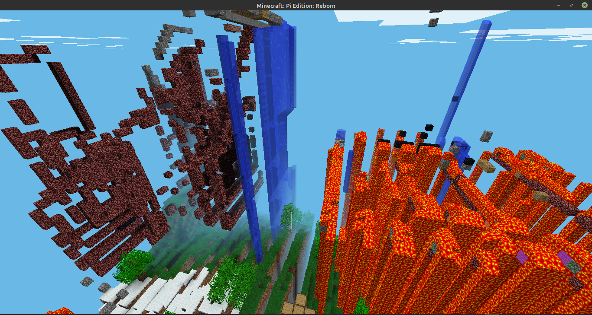

# Server World Corruption

Data corruption can affect the world files making the world have strange properties. If a
running server has its power cut or its storage device removed, the
world will corrupt, and individual one block wide slices of land will
separate from each other with a one block wide gap in between each slice.
The game-mode will also be turned to creative.

Data corruption probably occurs because the `level.dat` file is reset, which
clears the inventory, seed, and game-mode. Due to the changed seed, the
biome colors will not match with the actual biomes. It is advised to
back up your `level.dat` files if you want to revert this.

Since version 3.0.0, the mechanism for sending server chunks has changed
and the blocks will no longer become corrupted, however the biomes will
still be corrupted, as they depend on the seed.